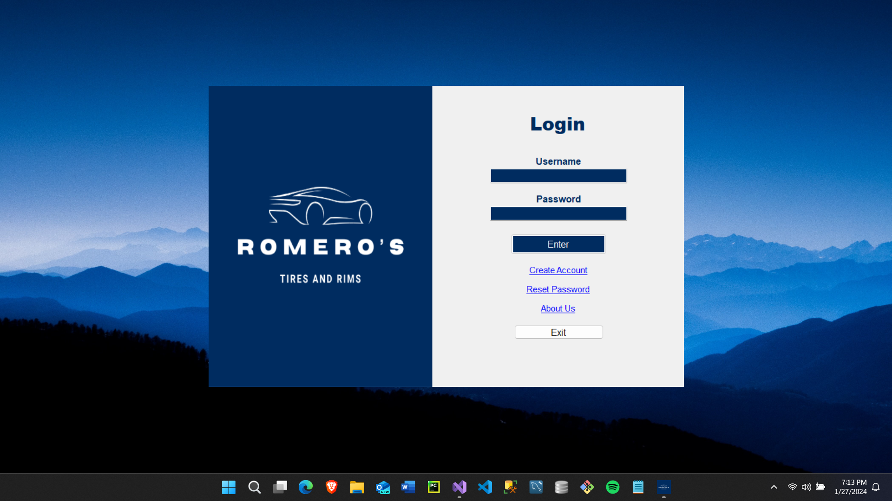
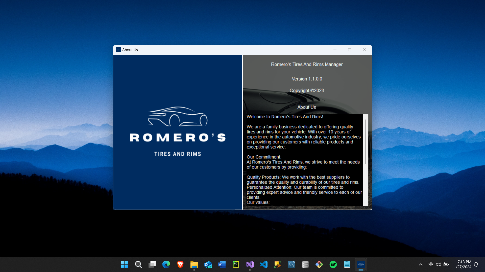
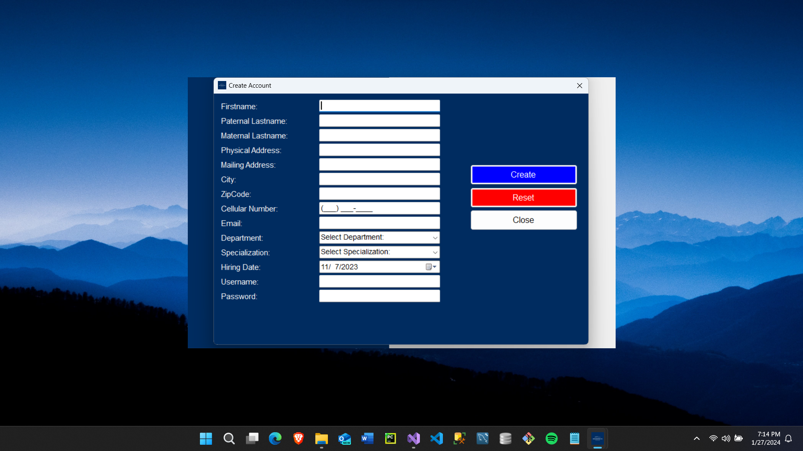
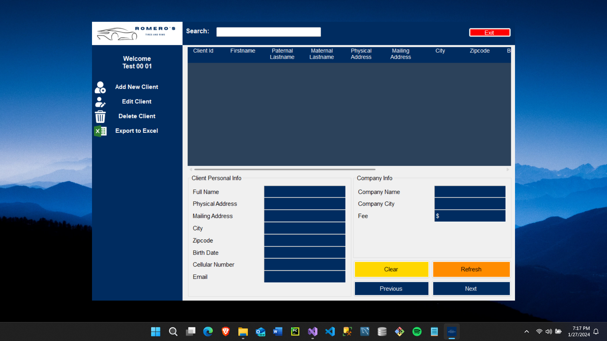

# Romeros Tires And Rims

This project is a Customer Relationship Management (CRM) and Point of Sale (POS) system developed in Visual Basic, specifically designed for businesses selling car tires, rims, and suspension parts. It enables salespersons to manage customers, conduct sales operations, and export data to Excel. It utilizes a Microsoft SQL Server database to store information.

## Installation

1. **Prerequisites:**
   - Visual Studio with support for Visual Basic.
   - Microsoft SQL Server installed and running.

2. **Database Setup:**
   - Execute the provided SQL script located in the `Database Config` folder to create the database structure and populate it with sample data.
     - The script file is named [DatabaseScript.sql].
     - You can find the script file within the `Database Config` folder in the project.

## Key Features

* **Customer Relationship Management (CRM):**
    * Create new customer profiles.
    * Edit existing customer information.
    * Delete customer profiles.
    * Search for customers by name, phone number, or other relevant criteria.
* **Point of Sale (POS):**
    * Record sales of tires, rims, and suspension parts.
    * Inventory management (implicit in sales functionality).
    * Generate sales reports.
* **User Management:**
    * Register new salespersons with information such as name, email, and password.
    * Secure login for salespersons.
* **Export to Excel:**
    * Export customer and/or sales information to Excel files for further analysis and reporting.
* **Database:**
    * Uses Microsoft SQL Server for data storage.

# Program Running Screenshots
### Login

### About Screen

### Create Account Screen

### Empty Dashboard Screen

### Dashboard With Data Screen

### Search Bar in Action

